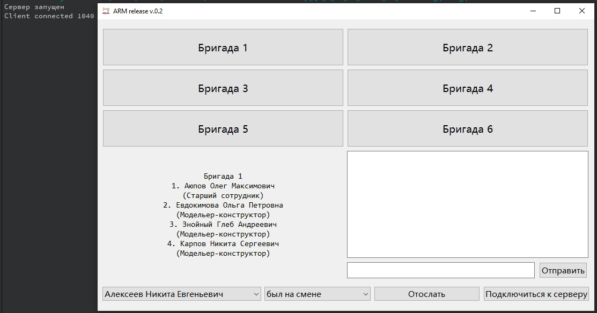
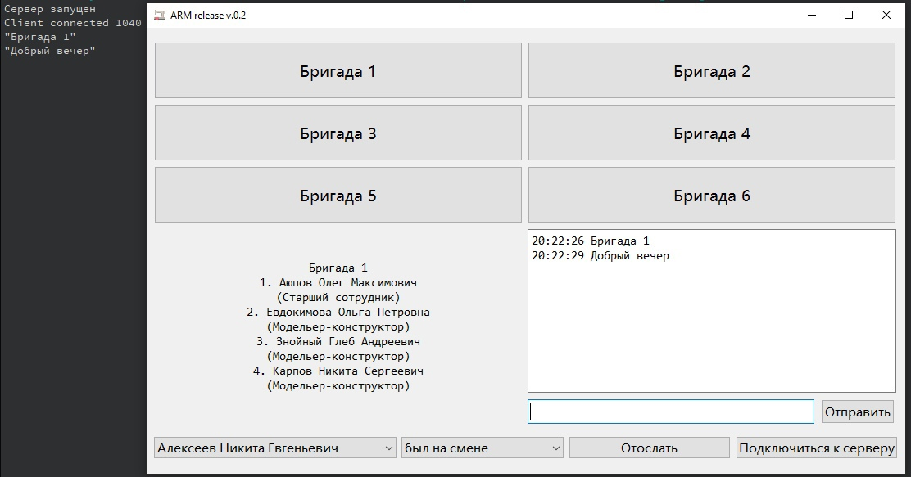
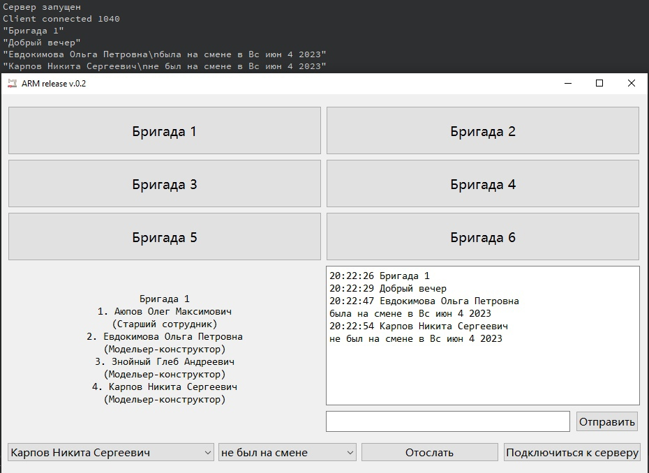
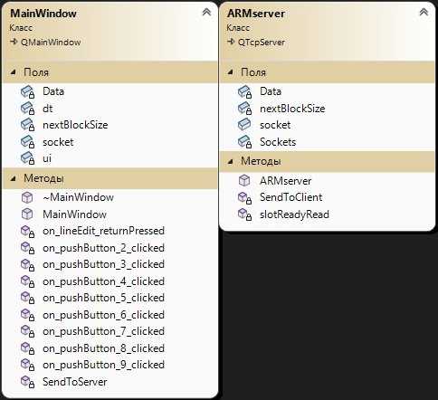

# Автоматизированное рабочее место специалиста
## Постановка задачи
Реализовать автоматизированное рабочее место специалиста (АРМ) - директора швейного цеха.
Программа должна выполнять следующие функции:
- Управление событиями;
- Хранение и отправка сообщений на сервер;
- Посменный учет работников и отправка уведомлений на сервер.

## Анализ задачи
- Для управления событиями использован фреймворк QT. QT содержит библиотеку классов, которая включает в себя множество готовых решений для создания различных функциональных частей приложений, имеет визуализатор, который позволяет разработчикам легко создавать красивые и интуитивно понятные пользовательские интерфейсы, предлагает инструменты, которые сокращают время на разработку и тестирование приложений, позволяя быстрее и удобнее разрабатывать ПО.
- Для разработки приложения необходимо создать сервер, на который будет осуществляться отправка сообщений и приложение клиента, откуда будут поступать сообщения. Также необходимо создать отправку текущего состояние виджетов на сервер.
- Для создания сервера были использованы QTcpServer и QTcpSocket, а также модули core и network. 

## Работа программы
### Запуск сервера

### Рис. 1 - Отправка сообщения

### Рис. 2 - Отправка текущего состояния виджета

## Рис. 3 - Диаграмма классов

