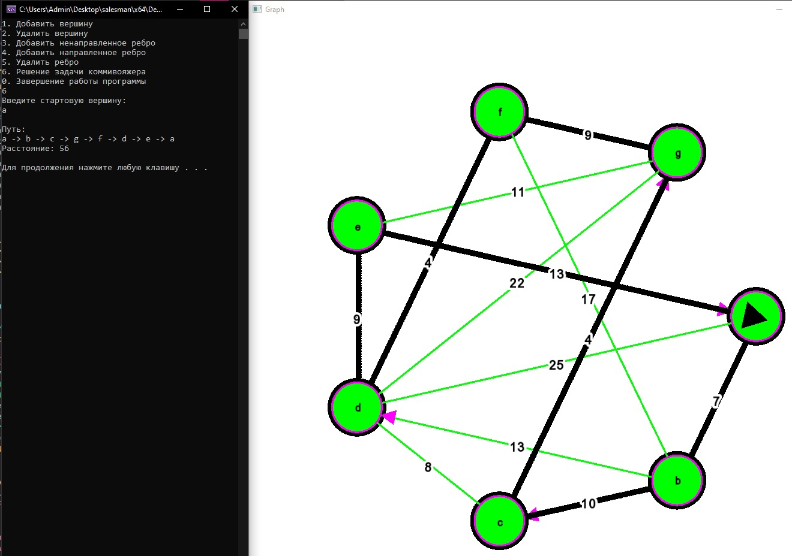
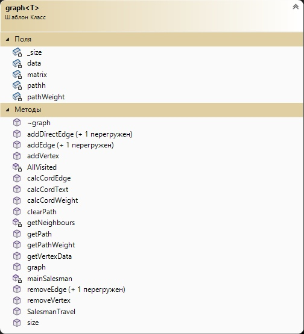

# Задача коммивояжера
## Постановка задачи

-Необходимо найти оптимальный маршрут, проходящий через все города хотя бы по одному разу с последующим возвратом в исходный город.

-Реализовать граф и решить для него задачу комивояжера методом ветвей и границ с визуализацией решения.

## Анализ задачи
- Граф хранится в виде массива с наименованием вершин и матрицы смежности. В графе реализованы методы для создания вершин, направленных и ненаправленных ребер. 
- Для решения задачи коммивояжера использован метод ветвей и границ, в основе которого лежит идея последовательного разбиения множества допустимых решений на подмножества. На каждом шаге метода элементы разбиения подвергаются проверке для выяснения, содержит данное подмножество оптимальное решение или нет.
- Для визуализации использована библиотека ```SFML``` Вершины графа отрисовываются по кругу. Посередине ребра располагается его вес, а в вершинах название вершин.
- Для визуализации решения задачи Комивояжера отрисовываться "указатель".

## Выполнение программы


Рис. 1 - Граф в первоначальном виде.

Рис. 2 - Визуализация решения задачи коммивояжера.

Рис. 3 - Визуализация еще одного решения задачи коммивояжера.

Рис. 4 - Диаграмма классов.
